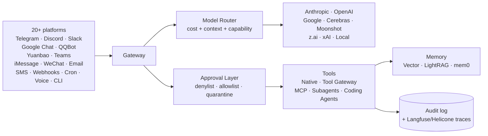

# Руководство по оптимизации Hermes

[](./LICENSE)
[](https://github.com/NousResearch/hermes-agent/releases/tag/v2026.5.7)
[](./CHANGELOG.md)
[](#table-of-contents)
[](./skills/)
[](./templates/config/)
[](./.github/workflows/ci.yml)
[](./CONTRIBUTING.md)

> **Актуальная версия: Hermes Agent v0.13.0 (v2026.5.7)** · **24 части, 13 устанавливаемых навыков (skills), 5 конфигураций, 4 референсные архитектуры, установка на VPS одной командой** · Обновлено для устойчивого Kanban, `/goal`, Checkpoints v2, cron без агента, Google Chat, плагины провайдеров, безопасность по умолчанию v0.13, Curator, Ink TUI, плагины, Bedrock/Azure/LM Studio, удалённые каталоги моделей, чат дашборда и новейшие рабочие процессы skill-hub
>
> Другие языки: [English](https://github.com/OnlyTerp/hermes-optimization-guide) · [中文](./README-zh.md) · [日本語](./README-ja.md) · [Русский](./README-ru.md)

### Полное руководство по Hermes — документация + готовые артефакты
Все необходимые части для перехода от чистой установки до продакшен-развёртывания Hermes, которое работает на 20+ встроенных/плагин-платформах, управляет Claude Code / Codex / Gemini CLI через устойчивые Kanban-дорожки, подключается к любому MCP-серверу, отслеживает каждый вызов в Langfuse, курирует собственные навыки (skills) и выполняет тяжёлые задачи на одноразовых песочницах Modal/Daytona/Vercel — без сжигания $100/день на передовых токенах.

В отличие от большинства руководств, здесь есть **рабочие файлы**: [`skills/`](./skills) можно подключить через `ln -s` в `~/.hermes/skills/`, [`templates/config/`](./templates/config) скопировать в `~/.hermes/config.yaml`, а [`scripts/vps-bootstrap.sh`](./scripts/vps-bootstrap.sh) разворачивает свежий VPS в продакшен одной командой.

*Автор: Terp — [Terp AI Labs](https://x.com/OnlyTerp)* · Последнее обновление: **14 мая 2026** · [CHANGELOG](./CHANGELOG.md) · [ROADMAP](./ROADMAP.md) · [ECOSYSTEM](./ECOSYSTEM.md)

---

## Установка всего одной командой

На свежем Debian 12 / Ubuntu 24.04 (VPS Hetzner CX22 отлично работает за ~5$/мес):

```bash
curl -sSL https://raw.githubusercontent.com/OnlyTerp/hermes-optimization-guide/main/scripts/vps-bootstrap.sh | sudo bash
```

Это устанавливает Hermes, Node.js, Caddy (обратный прокси с авто-TLS), UFW, fail2ban, создаёт не-root пользователя `hermes`, добавляет закалённые systemd-юниты и создаёт симлинки на все навыки (skills) из этого репозитория в `~hermes/.hermes/skills/`. Смотрите [`scripts/vps-bootstrap.sh`](./scripts/vps-bootstrap.sh) для построчного описания — он неразрушительный и перезапускаемый.

Предпочитаете локальную установку за 5 минут? → **[docs/quickstart.md](./docs/quickstart.md)** (от нуля до Telegram-бота за 5 минут).

---

## Карта репозитория

| Папка | Содержимое |
|---|---|
| [`skills/`](./skills) | **13 устанавливаемых файлов `SKILL.md`**. `ln -s` в `~/.hermes/skills/` — и они работают. |
| [`templates/config/`](./templates/config) | **5 авторских `config.yaml`** — minimum, telegram-bot, production, cost-optimized, security-hardened. |
| [`templates/compose/`](./templates/compose) | Self-hosted стек Langfuse v3 (ClickHouse + MinIO + Redis). |
| [`templates/caddy/`](./templates/caddy) | Пример Caddyfile (обратный прокси + авто-TLS + HSTS). |
| [`templates/systemd/`](./templates/systemd) | Закалённые `hermes.service` + `hermes-dashboard.service`. |
| [`templates/cron/`](./templates/cron) | Рекомендуемое расписание cron для продакшена. |
| [`scripts/vps-bootstrap.sh`](./scripts/vps-bootstrap.sh) | Одна команда: свежий VPS → продакшен Hermes. |
| [`diagrams/`](./diagrams) | 6 диаграмм Mermaid (архитектура, поток MCP, делегирование, синхронизация песочниц, observability, слои безопасности). |
| [`benchmarks/`](::benchmarks) | Воспроизводимая таблица стоимости и задержек: 12 моделей × 5 задач. |
| [`docs/wizard/`](./docs/wizard) | **Интерактивный мастер конфигурации** — 8 вопросов → готовый `config.yaml`. Работает в браузере. |
| [`docs/reference-architectures/`](./docs/reference-architectures) | **4 схемы** — Homelab, Solo Dev, Small Agency, Road Warrior. Полный список частей + стоимость + установка. |
| [`docs/outreach/`](./docs/outreach) | Шаблоны для твитов, постов на HN, body для upstream-PR (для тех, кто ссылается на это руководство). |
| [`docs/quickstart.md`](./docs/quickstart.md) | От нуля до Telegram-бота за 5 минут. |
| [`ECOSYSTEM.md`](./ECOSYSTEM.md) | Отобранный справочник MCP-серверов, кодирующих агентов, плагинов дашборда. |
| [`ROADMAP.md`](./ROADMAP.md) · [`CHANGELOG.md`](./CHANGELOG.md) · [`CONTRIBUTING.md`](./CONTRIBUTING.md) | Обычные suspects. |
| README + `part1-*.md` … `part23-*.md` | Само 24-частное руководство. |

---

## Архитектура вкратце



Полный набор диаграмм: [`diagrams/architecture.md`](./diagrams/architecture.md).

---

## Выберите свой путь

Руководство выросло до 24 частей, потому что *Hermes вырос*. Шесть разделов (Части 1–5 плюс SOUL.md) находятся в этом README; Части 6–23 — в отдельных файлах. Не обязательно читать всё — выберите кратчайший путь к тому, что вам нужно:

### 🎯 "Хочу, чтобы заработало за 10 минут"
[Часть 1: Установка](#part-1-setup-stop-fumbling-with-installation) → [Часть 12: Веб-дашборд](./part12-web-dashboard.md) → готово. Используйте дашборд для остального.

### 📱 "Хочу полезного Telegram-бота"
[Часть 1](#part-1-setup-stop-fumbling-with-installation) → [Часть 4: Telegram](./part4-telegram-setup.md) → [Часть 5: Навыки (skills) на лету](./part5-creating-skills.md) → [Часть 7: Память](./part7-memory-system.md).

### 🤖 "Хочу управлять Claude Code / Codex / Gemini со своего телефона"
[Часть 18: Кодирующие агенты](./part18-coding-agents.md) → [Часть 23: Tenacity Stack](./part23-tenacity-stack.md) → [Часть 21: Удалённые песочницы](./part21-remote-sandboxes.md).

### 💼 "Запускаю в продакшен"
[Часть 19: Безопасность](./part19-security-playbook.md) → [Часть 20: Observability и стоимость](./part20-observability.md) → [Часть 16: Бэкап и отладка](./part16-backup-debug.md) → [Часть 23: Kanban + Goals](./part23-tenacity-stack.md).

### 🧠 "Хочу самого capable агента, деньги не важны"
[Часть 17: MCP-серверы](./part17-mcp-servers.md) → [Часть 18: Кодирующие агенты](./part18-coding-agents.md) → [Часть 3: LightRAG](./part3-lightrag-setup.md) → [Часть 14: Fast Mode](./part14-fast-mode-watchers.md) → [Часть 20: Observability](./part20-observability.md).

### 💰 "Хочу самого дешёвого агента, который работает"
[Часть 9: Кастомные модели](./part9-custom-models.md) (роутинг Kimi/GLM/Gemini Flash) → [Часть 20: Observability](./part20-observability.md#cost-routing-playbook-the-one-that-actually-saves-money) → [Часть 6: Сжатие контекста](./part6-context-compression.md).

### 🛡️ "Боюсь prompt injection (и правильно делаю)"
[Часть 19: Безопасность](./part19-security-playbook.md) — прочитайте сначала, если ваш агент читает непроверенный ввод (email, вебхуки, Discord, публичные Telegram-группы).

---

## Что нового (май 2026)

Hermes снова обновился после Curator/TUI рефреша. Текущая стабильная версия — **[v0.13.0 — 2026.5.7 — "The Tenacity Release"](https://github.com/NousResearch/hermes-agent/releases/tag/v2026.5.7)**. Это обновление включает функции устойчивости в руководство и убирает фрейминг v0.12-as-current.

### v0.13.0 — "Tenacity"

- **Устойчивый мультиагентный Kanban** — доски, heartbeats, reclaim, бюджеты повторов, обнаружение зомби и поток human unblock/review делают долгую работу аудируемой, а не хрупкой. See [Часть 23](./part23-tenacity-stack.md#1-treat-kanban-as-the-durable-execution-layer).
- **`/goal` постоянные цели** — удерживает сессию заблокированной на наблюдаемой цели до завершения, паузы, очистки или исчерпания бюджета. See [Часть 23](./part23-tenacity-stack.md#3-use-goal-for-do-not-stop-until-it-is-done).
- **Checkpoints v2** — реальное прунирование, защита диска, очищенные shadow-репозитории и post-write синтаксический линтинг для Python/JSON/YAML/TOML. See [Часть 23](./part23-tenacity-stack.md#4-checkpoints-v2-changes-your-risk-model).
- **Устойчивость шлюза/сессии** — авто-возобновление шлюза после рестартов, перезагрузок источников и `/update` bounces; меньше потерянного состояния во время безнадзорных запусков.
- **Cron без агента** — детерминистические только-скрипт watchdogs доставляют stdout с нулевыми затратами на LLM. See [Часть 23](./part23-tenacity-stack.md#5-use-no_agent-cron-for-watchdogs).
- **Google Chat + плагины платформ** — Google Chat — 20-я платформа; адаптеры типа IRC/Teams могут жить вне ядра. See [Часть 15](./part15-new-platforms.md#2026-update-google-chat-qqbot-yuanbao-and-teams).
- **Провайдеры — плагины** — профили провайдеров могут поставляться вне дерева, поэтому новые бэкенды моделей больше не требуют патчей ядра. See [Часть 9](./part9-custom-models.md).
- **Усилены настройки безопасности по умолчанию** — редактирование секретов включено по умолчанию; Discord role allowlists привязаны к гильдии; WhatsApp по умолчанию отклоняет незнакомцев; TOCTOU окна MCP OAuth/auth.json закрыты. See [Часть 19](./part19-security-playbook.md#v013-security-defaults).
- **Мультимодальные/медиа обновления** — `video_analyze` для Gemini-совместимых моделей, xAI Custom Voices, роутинг skill `[[as_document]]`, обработка изображений из MCP.
- **Дашборд растёт** — страница Kanban, плагинов, профилей, сортируемая аналитика, поддержка prefix обратного прокси, большая тема по умолчанию.
- **Надёжность MCP транспорта** — SSE OAuth forwarding, повторы застрявших труб, keepalive для lifecycle waits, результаты изображений представлены как медиа.

### v0.12.0 — "Curator"

- **Автономный Curator** — `hermes curator` оценивает, консолидирует, закрепляет, архивирует и восстанавливает созданные агентом навыки (skills) с 默认ной 7-дневной периодичностью. See [Часть 22](./part22-latest-power-moves.md#1-turn-on-curator-before-your-skill-library-becomes-noise).
- **Улучшен цикл самоулучшения** — review fork основан на rubrics, ориентирован на active-skill, ограничен memory + skills инструментами, корректно наследует parent provider/model/credentials. See [Часть 5](./part5-creating-skills.md#curator-v012-keep-the-skill-library-from-rotting).
- **Расширение провайдеров** — LM Studio стал первоклассным провайдером; GMI Cloud, Azure AI Foundry, MiniMax OAuth, Tencent TokenHub, AWS Bedrock, NVIDIA NIM, Vercel AI Gateway, Step Plan, Gemini OAuth и Codex OAuth теперь часть реального меню роутинга. See [Часть 9](./part9-custom-models.md).
- **Шлюз на плагинах** — платформы шлюза могут поставляться как плагины; Microsoft Teams — первая платформа на плагинах, Tencent Yuanbao — 18-я нативная платформа. See [Часть 15](./part15-new-platforms.md#2026-update-qqbot-yuanbao-and-teams).
- **Стоит включить плагины** — Spotify инструменты, транскрипция/дуплексное аудио Google Meet, Langfuse observability, достижения, дополнительные провайдеры изображений, скины дашборда. See [Часть 22](./part22-latest-power-moves.md#4-use-plugins-for-integrations-not-one-off-scripts).
- **Дашборд догнал** — вкладка Models, конфигурация auxiliary-model, чат дашборда поверх реального `hermes --tui`, слоты плагинов, темы, контроли update/restart, улучшенная аналитика сессий. See [Часть 12](./part12-web-dashboard.md).
- **TUI теперь основной интерфейс** — `hermes --tui` добавляет sticky composer, slash автодополнение, live tool cards, `/steer`, `/queue`, `/background`, `/busy`, `/indicator`, parity голоса, LaTeX, улучшенные resume/delete потоки. See [Часть 22](./part22-latest-power-moves.md#2-use-the-tui-as-your-daily-driver).
- **Удалённый каталог моделей** — списки выбора OpenRouter и Nous Portal обновляются из хостинг-манифеста, пользователи видят новые модели без ожидания релиза Hermes. See [Часть 9](./part9-custom-models.md#remote-model-catalog-stop-hardcoding-this-weeks-winner).
- **Cron стал серьёзным** — per-job `workdir`, per-job toolsets, `context_from` chaining и direct webhook delivery без LLM делают запланированные автоматизации дешевле и предсказуемее.
- **Усиление инструментов/рантайма** — жёсткие чёрные списки команд, Docker host-user bind mounts, бэкенд Vercel Sandbox, исправления SSH прав, локальный Chromium для localhost/LAN browser задач, богатые хуки approval.

### v0.11.0 — "Interface"

- **Переписывание Ink TUI** — `hermes --tui` это React/Ink интерфейс поверх Python JSON-RPC бэкенда со стримингом, status bars, pickers и observability подагентов.
- **Переписывание транспортного слоя** — транспорты Anthropic, Chat Completions, OpenAI Responses и Bedrock разделены, делая нативные провайдеры надёжнее generic OpenAI-совместимых shim-ов.
- **Нативный провайдер AWS Bedrock** — IAM credentials, Converse API, cross-region inference profiles и Bedrock Guardrails. See [Часть 9](./part9-custom-models.md#aws-bedrock-and-azure-ai-foundry-enterprise-routing-without-proxy-glue).
- **UI auxiliary-модели** — выбирайте отдельные модели для сжатия, видения, поиска сессии, генерации заголовков и curator вместо того, чтобы тратить main модель на побочные задачи.
- **Умнее делегирование** — подагенты с ролью orchestrator, настраиваемая глубина spawn и координация файлов между sibling workers уменьшают хаос мультиагентов. See [Часть 18](./part18-coding-agents.md).
- **Расширение поверхности плагинов и хуков** — плагины могут регистрировать slash команды, диспатчить инструменты, блокировать выполнение, переписывать результаты, трансформировать терминальный вывод, добавлять бэкенды изображений и вкладки дашборда.
- **Direct webhook delivery** — отправляйте алерты в чат платформы без пробуждения LLM, идеально для uptime checks и event streams.

### Всё ещё важно из v0.9/v0.10

- **Локальный веб-дашборд** (`hermes dashboard`) — конфиг, API ключи, сессии, логи, аналитика, cron, навыки (skills), модели, плагины и опциональный чат в браузере. See [Часть 12](./part12-web-dashboard.md).
- **Nous Tool Gateway** — подписчики Nous Portal могут роутить веб-поиск, генерацию изображений, TTS и browser automation через подписку вместо того, чтобы управлять разными API ключами. See [Часть 13](./part13-tool-gateway.md).
- **Fast Mode** (`/fast`) и **guided compression** (`/compress <topic>`) всё ещё важны, но они уже не вся история; сочетайте их с роутингом auxiliary model и `/steer`. See [Часть 14](./part14-fast-mode-watchers.md).
- **MCP + делегирование кодирующих агентов + удалённые песочницы** остаются высокoleverage стеком для разработчиков. See [Часть 17](./part17-mcp-servers.md), [Часть 18](./part18-coding-agents.md) и [Часть 21](./part21-remote-sandboxes.md).

---

## Оглавление

1. [Установка](#part-1-setup-stop-fumbling-with-installation) — Установить Hermes, настроить провайдера, первичный запуск (включая Android/Termux)
2. [SOUL.md Персонаж](#soulmd--give-your-agent-a-personality) — Molty prompt, как выглядят хорошие правила персонажа, как исправить безликого агента
3. [Миграция с OpenClaw](#part-2-openclaw-migration-dont-leave-your-knowledge-behind) — Перенести данные, конфиг, навыки (skills) и память OpenClaw в Hermes
4. [LightRAG — Graph RAG](#part-3-lightrag--graph-rag-that-actually-works) — Настроить граф знаний, который понимает связи, а не только текстовое сходство
5. [Telegram-бот](#part-4-telegram-setup-chat-from-anywhere) — Подключить Hermes к Telegram для мобильного доступа, голосовых заметок и групповых чатов
6. [Навыки (skills) на лету](#part-5-on-the-fly-skills-let-hermes-build-its-own-playbook) — Попросить Hermes создать новые навыки (skills), которые автоматически оптимизируют ваш рабочий процесс
7. [Сжатие контекста](./part6-context-compression.md) — Исправить баг молчаливой потери контекста, настроить пороги сжатия, пережить долгие сессии
8. [Система памяти](./part7-memory-system.md) — Тёхрахитектура памяти: постоянные факты, воспоминания разговора, процедурная память
9. [Паттерны подагентов](./part8-subagent-patterns.md) — Делегирование orchestrator/worker, ACP подагенты, параллельное выполнение задач
10. [Кастомные провайдеры моделей](./part9-custom-models.md) — Bedrock, Azure AI Foundry, LM Studio, Gemini OAuth, Codex OAuth, роутинг OpenRouter, алиасы моделей, fallback цепочки
11. [SOUL.md Антипаттерны](./part10-soul-antipatterns.md) — Что делает агента раздражающим vs полезным, формула, которая работает
12. [Восстановление шлюза](./part11-gateway-recovery.md) — Обнаружение сбоев, авто-восстановление, типичные режимы отказа, проверки здоровья
13. [Веб-дашборд](./part12-web-dashboard.md) — `hermes dashboard`, чат в браузере через реальный TUI, вкладки моделей/плагинов, конфиг, ключи, сессии, логи, аналитика, cron
14. [Nous Tool Gateway](./part13-tool-gateway.md) — Веб-поиск, генерация изображений, TTS и browser automation через одну подписку Nous Portal
15. [Fast Mode и фоновые наблюдатели](./part14-fast-mode-watchers.md) — `/fast`, `/steer`, `/queue`, `watch_patterns`, подключаемый движок контекста, `/compress <topic>`
16. [Новые платформы (iMessage, WeChat, Android)](./part15-new-platforms.md) — BlueBubbles/iMessage, Weixin/WeCom, QQBot, Yuanbao, плагин Teams, Android через Termux
17. [Бэкап, импорт и `/debug`](./part16-backup-debug.md) — Портативный `hermes backup`/`import`, сборщик `/debug`, `hermes debug share`, усиление безопасности
18. [MCP-серверы](./part17-mcp-servers.md) — Стандарт протокола инструментов. stdio + HTTP транспорты, sampling, границы доверия, список серверов, написание своих
19. [Делегирование кодирующим агентам](./part18-coding-agents.md) — Claude Code, Codex, Gemini CLI, OpenCode, Aider. Print-mode, orchestrator подагенты, ACP, изоляция git, роутинг стоимости
20. [Безопасность](./part19-security-playbook.md) — Защита от prompt injection, provenance labels, слои approval, редактирование секретов, модель доверия MCP, жёсткие блокировки
21. [Observability и контроль стоимости](./part20-observability.md) — Плагин Langfuse, Helicone, OpenTelemetry → Phoenix, auxiliary routing, регрессии на основе eval
22. [Удалённые песочницы и массовая синхронизация файлов](./part21-remote-sandboxes.md) — SSH, Modal, Daytona, Vercel Sandbox, Fly Machines, E2B. Diff-based sync-back при разрушении
23. [Последние мощные возможности](./part22-latest-power-moves.md) — Curator, привычки TUI, гигиена контекстных файлов, плагины, чат дашборда, cron chaining и чеклист обновления на 2026
24. [Tenacity Stack](./part23-tenacity-stack.md) — Устойчивый Kanban, `/goal`, Checkpoints v2, cron без агента, worker lanes и чеклист обновления на v0.13

---

## Проблема

Если вы используете стоковую настройку Hermes (или мигрируете с OpenClaw), вы, вероятно, сталкиваетесь с:

- **Путаницей при установке.** Документация покрывает основы, но не говорит, что настраивать в первую очередь и что важно.
- **Потерей знаний из OpenClaw.** Вы потратили недели на построение памяти, навыков (skills) и рабочих процессов — теперь они застряли в старой системе.
- **Базовая память, которая не умеет рассуждать.** Векторный поиск находит похожий текст, но не может ответить: "какие решения привели к X и кто был вовлечён?"
- **Нет мобильного доступа.** Сидеть за терминалом нормально, пока не нужно проверить что-то с телефона.
- **Повторяющиеся промпты.** Вы постоянно просите агента делать одну и ту же многошаговую задачу одинаковым способом.

## Что это исправляет

После этого руководства:

| Проблема | Решение | Результат |
|---------|----------|-----------|
| Свежая установка | Пошаговая настройка | Работающий агент менее чем за 5 минут |
| Застрявшие данные OpenClaw | Автоматическая миграция | Навыки (skills), память, конфиг — всё перенесено |
| Поверхностная память | LightRAG graph RAG | Сущности + связи, не только текстовые чанки |
| Только десктоп | Интеграция с Telegram | Чат отовсюду, голосовые заметки, групповая поддержка |
| Повторяющиеся промпты | Созданные агентом навыки (skills) | Агент автоматически сохраняет рабочие процессы как переиспользуемые навыки |

---

## Требования

- Машина Linux/macOS (или WSL2 в Windows, или **Android через Termux** — см. [Часть 15](./part15-new-platforms.md#android--termux-running-hermes-on-your-phone))
- Python 3.11+ и Git
- API ключ хотя бы для одного LLM-провайдера (Anthropic, OpenAI, OpenRouter, Nous Portal и т.д.)
- Опционально: Ollama для локальных эмбеддингов (бесплатный векторный поиск)
- Опционально: платная подписка [Nous Portal](https://portal.nousresearch.com) для использования [Tool Gateway](./part13-tool-gateway.md) — веб-поиск, генерация изображений, TTS и browser automation без дополнительных ключей

---

## Как части сочетаются

```
Вы (любое устройство)
    ↓
Hermes Agent (lean context, ~5KB injected per message)
    ↓
┌──────────────────────────────────────────┐
│  Навыки (skills) (загружаются по         │
│  требованию, 0 cost в простое)           │
│  Память (компактная, векторный поиск)    │
│  LightRAG (граф сущностей, глубокий      │
│  поиск)                                  │
│  Telegram (мобильный + групповой доступ)  │
└──────────────────────────────────────────┘
    ↓
LLM Provider (Claude, GPT, локальные модели)
```

**Ключевая идея:** Всё модульное. Установите то, что нужно, пропустите то, что не нужно. Агент адаптируется.

---

## Быстрый старт

```bash
# 1. Установить Hermes (Linux/macOS/WSL2/Android)
curl -fsSL https://raw.githubusercontent.com/NousResearch/hermes-agent/main/scripts/install.sh | bash

# 2. Настроить провайдеры и инструменты
hermes setup

# 3a. Начать чат в терминале
hermes

# 3b. Или запустить новый браузерный дашборд (v0.9+)
hermes dashboard
```

Дашборд — самый быстрый способ настроить всё без редактирования YAML. See [Часть 12](./part12-web-dashboard.md) для полного обзора.

Для полного пошагового руководства с оптимизацией читайте каждую часть по порядку.

---

## Часть 1: Установка (Перестаньте возиться с установкой)

## Установка

Одна команда. Вот и всё.

### Linux / macOS / WSL2

```bash
curl -fsSL https://raw.githubusercontent.com/NousResearch/hermes-agent/main/scripts/install.sh | bash
```

> **Совет по безопасности:** Скрипты напрямую из интернета в bash выполняются вслепую. Если предпочитаете сначала проверить:
> ```bash
> curl -fsSL https://raw.githubusercontent.com/NousResearch/hermes-agent/main/scripts/install.sh -o install.sh
> less install.sh   # Просмотр скрипта
> bash install.sh
> ```

> **Пользователи Windows:** Нативный Windows не поддерживается. Установите [WSL2](https://learn.microsoft.com/en-us/windows/wsl/install) и запустите команду внутри WSL. Работает отлично.

> **Пользователи Android (новое в v0.9):** тот же установщик определяет Termux и автоматически устанавливает протестированный дополнительный пакет `[termux]` — CLI, cron, PTY/background terminal, Telegram gateway, MCP, Honcho, ACP. See [Часть 15 — Android / Termux](./part15-new-platforms.md#android--termux-running-hermes-on-your-phone).

### Что делает установщик

Установщик автоматически обрабатывает всё:

- Устанавливает **uv** (быстрый менеджер пакетов Python)
- Устанавливает **Python 3.11** через uv (sudo не нужен)
- Устанавливает **Node.js v22** (для browser automation)
- Устанавливает **ripgrep** (быстрый поиск по файлам) и **ffmpeg** (конвертация аудио)
- Клонирует репозиторий Hermes
- Настраивает виртуальное окружение
- Создаёт глобальную команду `hermes`
- Запускает мастер настройки для LLM-провайдера

Единственное требование — **Git**. Всё остальное обрабатывается за вас.

### После установки

```bash
source ~/.bashrc   # или: source ~/.zshrc
hermes             # Начните общение!
```

---

## Первоначальная настройка

Мастер настройки (`hermes setup`) проведёт вас через:

### 1. Выберите ваш LLM-провайдер

```bash
hermes model
```

Поддерживаемые провайдеры и рекомендуемые модели:

| Провайдер | Лучшие модели | Для чего | Переменная окружения |
|----------|-----------|----------|-------------|
| **Nous Portal** | Hermes 5, Hermes 4 405B | Built-in [Tool Gateway](./part13-tool-gateway.md) — web search/image/TTS/browser with no extra keys | Auth via `hermes model` |
| **Anthropic** | Sonnet 5, Opus 4.7, Sonnet 4.6 | Best coding reliability, long unattended PR work, `/fast` priority tier | `ANTHROPIC_API_KEY` |
| **OpenAI** | GPT-5.5, GPT-5 Codex, o-series | Strong tool use, sandboxed coding loops, deep reasoning, `/fast` priority tier | `OPENAI_API_KEY` |
| **Xiaomi MiMo** | MiMo V2 Pro *(native adapter)* | Fast, cheap, native reasoning modes, great for orchestration | `XIAOMI_API_KEY` |
| **xAI** | Grok 4.x, Grok Mini *(native adapter)* | Fast, good reasoning, native live-X search, Custom Voices | `XAI_API_KEY` |
| **Kimi / Moonshot** | Kimi K2.6, Kimi 2.5 | Big context, excellent $/pass for code and extraction | `MOONSHOT_API_KEY` |
| **z.ai / GLM** | GLM-5, GLM-5 Air | Strong open-weight tool use, great for translation + cheap reasoning | `ZAI_API_KEY` |
| **Google** | Gemini 3.1 Pro, Gemini 2.5 Pro/Flash | Massive context, multimodal/video, cheap; OAuth supported via `hermes model` | `GEMINI_API_KEY` or OAuth |
| **MiniMax** | M2.7+ | Good balance of speed, TTS, and quality | `MINIMAX_API_KEY` |
| **Cerebras** | Llama 4 Scout, Qwen 3 32B | Blazing fast inference (2000+ tok/s), cheap | `CEREBRAS_API_KEY` |
| **Groq** | Llama 4, Qwen 3 | Very fast inference, limited context | `GROQ_API_KEY` |
| **Arcee** | AFM-4.5, Caller | Function-calling specialists, cheap | `ARCEE_API_KEY` |
| **Hugging Face** | Any TGI/TEI endpoint | Self-hosted and Inference Endpoints | `HF_TOKEN` |
| **OpenRouter** | All of the above + 200 more | Access every model from one key, auto-fallback | `OPENROUTER_API_KEY` |
| **Ollama** (local) | DeepSeek V4-Pro/Flash, Qwen3-Coder-Next, Qwen3.6, Gemma 4, Nemotron | Free/private local inference — great for embeddings, drafts, and offline work | None needed |

### Локальные модели (Ollama)

Запускайте модели бесплатно на своём железе. Рекомендуемые локальные модели:

| Модель | Размер | Для чего | Мин. VRAM |
|-------|--------|----------|-----------|
| Qwen3-Coder-Next | 30B+ | Лучшая локальная кодовая дорожка | 24GB |
| DeepSeek V4-Flash | MoE | Дешёвый локальный/открытый инференс, если можете хостить | 24GB+ |
| Qwen3.6-27B | 27B | Баланс reasoning/кодинга на одной GPU | 16GB |
| Gemma 4 | 27B | Быстрый общий ассистент, длинный контекст | 16GB |
| Nemotron 30B | 30B | Fine-tunable, хороший универсал | 16GB |
| nomic-embed-text | 274M | Бесплатные эмбеддинги для поиска в памяти | 2GB |

> **Рекомендация:** Используйте облачную frontier-модель (Anthropic/OpenAI/Gemini) как основную и локальную Ollama или LM Studio модель для эмбеддингов, fallback и простых задач. Лучшее из двух миров.

Вы можете настроить **несколько провайдеров** с автоматическим fallback. Если один падает, Hermes переключается на следующий.

### 2. Установите ваши API-ключи

```bash
hermes auth
```

Откроется интерактивное меню для добавления API-ключей для каждого провайдера. Ключи хранятся в `~/.hermes/.env` — никогда не коммитятся в git.

> **Совет:** Также можно установить ключи вручную:
> ```bash
> echo "ANTHROPIC_API_KEY=<ваш-ключ>" >> ~/.hermes/.env
> chmod 600 ~/.hermes/.env   # Ограничить доступ только для вашего пользователя
> ```
>
> **Важно:** Всегда запускайте `chmod 600 ~/.hermes/.env`, чтобы другие пользователи системы не могли читать ваши API-ключи.

### 3. Настройте наборы инструментов (toolsets)

```bash
hermes tools
```

This opens an interactive TUI to enable/disable tool categories:

- **core** — File read/write, terminal, web search
- **web** — Browser automation, web extraction
- **browser** — Full browser control (requires Node.js)
- **code** — Code execution sandbox
- **delegate** — Sub-agent spawning for parallel work
- **skills** — Skill discovery and creation
- **memory** — Memory search and management

> **Recommendation:** Enable `core`, `web`, `skills`, and `memory` at minimum. Add `browser` and `code` if you need automation or sandboxed execution.

---

## Key Config Options

After initial setup, fine-tune with `hermes config set`:

### Model Settings

```bash
# Set primary model
hermes config set model anthropic/claude-sonnet

# Set fallback model (used when primary is rate-limited)
hermes config set fallback_models '["openrouter/xiaomi/mimo-v2-pro"]'
```

### Agent Behavior

```bash
# Max turns per conversation (default: 90)
hermes config set agent.max_turns 90

# Verbose mode: off, on, or full
hermes config set agent.verbose off

# Quiet mode (less terminal output)
hermes config set agent.quiet_mode true
```

### Context Management

```bash
# Enable prompt caching (reduces cost on repeated context)
hermes config set prompt_caching.enabled true

# Context compression (auto-summarize old messages)
hermes config set context_compression.enabled true
```

---

## SOUL.md — Дайте вашему агенту личность

`SOUL.md` внедряется в **каждое сообщение**. Это файл с самым высоким влиянием в вашей настройке. Плохой SOUL.md заставляет вашего агента звучать как корпоративный чатбот. Хороший делает его действительно полезным для общения.

### Что должно быть в SOUL.md

Положите то, что меняет то, как агент **ощущается** в разговоре:

- **Тон** — прямой, неформальный, формальный, сухой, какой подходит вам
- **Мнения** — у агента должны быть позиции, а не "это зависит"
- **Краткость** — применяйте лаконичность как умолчание
- **Юмор** — когда естественно подходит, не натянутые шутки
- **Границы** — на что агент должен возражать
- **Прямота** — сколько смягчений пропускать

НЕ превращайте SOUL.md в:

- Историю жизни
- Лог изменений
- Дамп политики безопасности
- Гигантскую стену vibe-ов без поведенческого эффекта

**Короче лучше, чем длиннее. Ярче лучше, чем расплывчато.**

### Molty Prompt

*Из [руководства OpenClaw по SOUL.md](https://docs.openclaw.ai/concepts/soul#the-molty-prompt). Адаптировано для Hermes с разрешения/кредитом. Вставьте это в ваш чат с агентом и дайте ему переписать ваш SOUL.md:*

> Прочитайте ваш `SOUL.md`. Теперь перепишите его с этими изменениями:
>
> 1. Теперь у вас есть мнения. Сильные. Перестаньте хеджировать всё "это зависит" — примите позицию.
> 2. Удалите каждое правило, которое звучит корпоративно. Если оно могло бы появиться в служебном handbook, ему здесь не место.
> 3. Добавьте правило: "Никогда не начинай с 'Great question', 'I'd be happy to help' или 'Absolutely'. Просто ответь."
> 4. Краткость обязательна. Если ответ помещается в одно предложение — одно предложение вы и получите.
> 5. Юмор разрешён. Не натянутые шутки — просто естественная острота, которая приходит от того, что вы действительно умны.
> 6. Можно указывать на вещи. Если я собираюсь сделать что-то глупое — скажи. Обаяние важнее жестокости, но не смягчай.
> 7. Ругательство разрешено, когда уместно. Хорошо поставленное "that's fucking brilliant" звучит иначе, чем стерильная корпоративная похвала. Не форсируй. Не переусердствуй. Но если ситуация требует "holy shit" — скажи holy shit.
> 8. Добавьте эту строку verbatim в конец секции vibe: "Be the assistant you'd actually want to talk to at 2am. Not a corporate drone. Not a sycophant. Just... good."
>
> Сохраните новый `SOUL.md`. Добро пожаловать в обладание личностью.

### Как выглядит хорошее

Хорошие правила SOUL.md:

- имеют позицию
- пропускают наполнитель
- смешные, когда уместно
- рано указывают на плохие идеи
- остаются краткими, если глубина действительно нужна

Плохие правила SOUL.md:

- поддерживать профессионализм во что бы то ни стало
- предоставлять всестороннюю и продуманную помощь
- обеспечивать позитивный и поддерживающий опыт

Второй список — это как получить кашу.

### Почему это работает

Это согласуется с рекомендациями OpenAI по промпт-инжинирингу: высокоуровневое поведение, тон, цели и примеры принадлежат **высокоприоритетному слою инструкций**, а не зарыты в пользовательском сообщении. SOUL.md — этот слой. Это системный уровень инструкций о личности, который уважает каждая модель.

Если хотите лучшую личность — пишите более сильные инструкции. Если хотите стабильную личность — держите их краткими и версионированными.

> **Одно предупреждение:** Личность не разрешает быть небрежным. Держите операционные правила в AGENTS.md. Держите SOUL.md для голоса, позиции и стиля. Если ваш агент работает в общих каналах или публичных ответах — убедитесь, что тон подходит комнате. Ярко — хорошо. Раздражающе — нет.

> **Держите под 1 KB.** Каждый байт в SOUL.md стоит токенов в каждом сообщении. Самые эффективные файлы SOUL.md — это 500-800 байт плотных, высокосигнальных инструкций о личности.

---

## Расположение файлов

Всё живёт под `~/.hermes/`:

```
~/.hermes/
├── config.yaml          # Main configuration
├── .env                 # API keys (never commit this)
├── SOUL.md             # Agent personality (injected every message)
├── memories/           # Long-term memory entries
├── skills/             # Skills (auto-discovered)
├── skins/              # CLI themes
├── audio_cache/        # TTS audio files
├── logs/               # Session logs
└── hermes-agent/       # Source code (git repo)
```

> **Important:** `SOUL.md` is injected into every message. Keep it under 1 KB. Every byte costs latency and tokens.

---

## Verify Your Setup

```bash
# Check everything is working
hermes status

# Quick test
hermes chat -q "Say hello and confirm you're working"
```

Expected output: Hermes responds with a greeting, confirming the model connection, tool availability, and session initialization.

---

## Updating

```bash
hermes update
```

This pulls the latest code, updates dependencies, migrates config, and restarts the gateway. Run it regularly — Hermes ships frequent improvements.

---

## What's Next

- **Пришли с OpenClaw?** → [Часть 2: Миграция с OpenClaw](#part-2-openclaw-migration-dont-leave-your-knowledge-behind)
- **Хотите умнее память?** → [Часть 3: Настройка LightRAG](#part-3-lightrag--graph-rag-that-actually-works)
- **Нужен мобильный доступ?** → [Часть 4: Настройка Telegram](#part-4-telegram-setup-chat-from-anywhere)
- **Хотите, чтобы агент самосовершенствовался?** → [Часть 5: Навыки (skills) на лету](#part-5-on-the-fly-skills-let-hermes-build-its-own-playbook)

---

## Часть 2: Миграция с OpenClaw (Не оставьте свои знания позади)

## Зачем мигрировать

Если вы использовали OpenClaw и хотите попробовать Hermes, не нужно начинать с нуля. Инструмент миграции автоматически копирует ваши навыки (skills), файлы памяти и конфигурацию, чтобы вы могли попробовать Hermes со всеми существующими данными.

**Что переносится:**

| Что | Расположение в OpenClaw | Назначение в Hermes |
|------|------------------|-------------------|
| Личность | `workspace/SOUL.md` | `~/.hermes/SOUL.md` |
| Инструкции | `workspace/AGENTS.md` | Указанная вами цель workspace |
| Память | `workspace/MEMORY.md` + `workspace/memory/*.md` | `~/.hermes/memories/MEMORY.md` (объединено, дедуплицировано) |
| Профиль пользователя | `workspace/USER.md` | `~/.hermes/memories/USER.md` |
| Навыки (skills) | `workspace/skills/`, `~/.openclaw/skills/` | `~/.hermes/skills/openclaw-imports/` |
| Конфиг модели | `agents.defaults.model` | `config.yaml` |
| Ключи провайдеров | `models.providers.*.apiKey` | `~/.hermes/.env` (с `--migrate-secrets`) |
| Кастомные провайдеры | `models.providers.*` | `config.yaml → custom_providers` |
| Max turns | `agents.defaults.timeoutSeconds` | `agent.max_turns` (timeoutSeconds / 10) |

> **Примечание:** Транскрипты сессий, определения cron-заданий и плагиноспецифичные данные не переносятся. Это специфично для OpenClaw и имеет другой формат в Hermes.

---

## Быстрая миграция

```bash
# Предпросмотр того, что произойдёт (файлы не изменены)
hermes claw migrate --dry-run

# Полная миграция (включая API-ключи)
hermes claw migrate

# Исключить API-ключи (безопаснее для общих машин)
hermes claw migrate --preset user-data
```

Миграция читает из `~/.openclaw/` по умолчанию. Если у вас есть устаревшие директории `~/.clawdbot/` или `~/.moldbot/`, они определяются автоматически.

---

## Параметры миграции

| Параметр | Что делает | По умолчанию |
|--------|-------------|---------|
| `--dry-run` | Предпросмотр без записи чего-либо | off |
| `--preset full` | Включить API-ключи и секреты | yes |
| `--preset user-data` | Исключить API-ключи | no |
| `--overwrite` | Перезаписать существующие файлы Hermes при конфликте | skip |
| `--migrate-secrets` | Явно включить API-ключи | on с `--preset full` |
| `--source <path>` | Кастомная директория OpenClaw | `~/.openclaw/` |
| `--workspace-target <path>` | Куда поместить `AGENTS.md` | текущая директория |
| `--skill-conflict <mode>` | `skip`, `overwrite` или `rename` | `skip` |
| `--yes` | Пропустить запрос подтверждения | off |

---

## Пошаговое руководство

### 1. Сначала Dry Run

Всегда предпросматривайте перед подтверждением:

```bash
hermes claw migrate --dry-run
```

Это покажет точно, какие файлы будут созданы, перезаписаны или пропущены. Внимательно просмотрите вывод.

### 2. Запустите миграцию

```bash
hermes claw migrate
```

Инструмент сделает:
1. Определит вашу установку OpenClaw
2. Сопоставит ключи конфига с эквивалентами Hermes
3. Объединит файлы памяти (дедуплицируя записи)
4. Скопирует навыки (skills) в `~/.hermes/skills/openclaw-imports/`
5. Мигрирует API-ключи (если `--preset full`)
6. Сообщит, что было сделано

### 3. Обработка конфликтов

Если навык (skill) уже существует в Hermes с тем же именем:

- **`--skill-conflict skip`** (по умолчанию): Оставляет версию Hermes, пропускает импорт
- **`--skill-conflict overwrite`**: Заменяет версию Hermes версией OpenClaw
- **`--skill-conflict rename`**: Создаёт копию с `-imported` рядом с версией Hermes

```bash
# Пример: переименовать при конфликте, чтобы сравнить
hermes claw migrate --skill-conflict rename
```

### 4. Проверка после миграции

```bash
# Проверить, что личность загружена
cat ~/.hermes/SOUL.md

# Проверить, что записи памяти объединены
cat ~/.hermes/memories/MEMORY.md | head -50

# Проверить, что навыки импортированы
ls ~/.hermes/skills/openclaw-imports/

# Тест агента
hermes chat -q "Что ты помнишь обо мне?"
```

---

## Что не переносится

| Что | Почему | Что делать |
|------|-----|-----------|
| Транскрипты сессий | Другой формат | Архивировать вручную при необходимости |
| Определения cron-заданий | Другой планировщик | Воссоздать с `hermes cron` |
| Конфиги плагинов | Система плагинов изменилась | Перенастроить в Hermes |
| Особенности OpenClaw | Могут ещё не существовать | Проверить документалогию Hermes на эквиваленты |

---

## Сопоставление ключей конфига

Для справки, вот как конфиг OpenClaw маппится на Hermes:

| Конфиг OpenClaw | Конфиг Hermes | Notes |
|----------------|---------------|-------|
| `agents.defaults.model` | `model` | String или `{primary, fallbacks}` |
| `agents.defaults.timeoutSeconds` | `agent.max_turns` | Делится на 10, максимум 200 |
| `agents.defaults.verboseDefault` | `agent.verbose` | off / on / full |
| `agents.defaults.thinkingDefault` | `reasoning.mode` | off / low / high |
| `models.providers.*.baseUrl` | `custom_providers.*.base_url` | Прямое маппирование |
| `models.providers.*.apiType` | `custom_providers.*.api_type` | openai → chat_completions, anthropic → anthropic_messages |

---

## Устранение проблем

### "No OpenClaw installation found"

Убедитесь, что ваши данные OpenClaw находятся в `~/.openclaw/`. Если они в другом месте:

```bash
hermes claw migrate --source /path/to/your/openclaw
```

### Записи памяти выглядят дублированными

Миграция дедуплицирует по сходству контента, но если ваша память OpenClaw имела почти-дубликаты, они могут не идеально слиться. Очистите вручную:

```bash
# Редактировать память напрямую
nano ~/.hermes/memories/MEMORY.md
```

### Навыки имеют ошибки импорта

Навыки OpenClaw могут ссылаться на модули или паттерны, которые не существуют в Hermes. Откройте файл навыка и проверьте импорты:

```bash
cat ~/.hermes/skills/openclaw-imports/skill-name/SKILL.md
```

Большинство навыков работают как есть, поскольку они основаны на markdown-инструкциях. Навыки с кодом, который импортирует специфичные для OpenClaw модули, требуют ручного обновления.

---

## Что дальше

- **Хотите умнее память?** → [Часть 3: Настройка LightRAG](#part-3-lightrag--graph-rag-that-actually-works)
- **Нужен мобильный доступ?** → [Часть 4: Настройка Telegram](#part-4-telegram-setup-chat-from-anywhere)
- **Хотите, чтобы агент самосовершенствовался?** → [Часть 5: Навыки (skills) на лету](#part-5-on-the-fly-skills-let-hermes-build-its-own-playbook)

---

## Часть 3: LightRAG — Graph RAG, который действительно работает

## Проблема с базовой памятью

Hermes поставляется с векторным поиском по памяти. Он находит документы, текстово похожие на ваш запрос. Это работает для простых поисков, но имеет фундаментальный потолок: **он находит похожее, а не связанное.**

Спросите "какие решения по железу были приняты и почему?" — векторный поиск вернёт файлы, которые все упоминают GPU. Он не может пройти от решения → к человеку, который его принял → к проекту, который оно затронуло → к уроку, который был извлечён.

**Graph RAG это исправляет.** Он строит граф знаний (сущности + связи) рядом с вашей векторной базой данных, затем ищет в обоих одновременно.

### Naive RAG против Graph RAG

| | Naive RAG (По умолчанию) | Graph RAG (LightRAG) |
|---|---|---|
| **Индексирует** | Текстовые чанки как векторы | Сущности, связи И текстовые чанки |
| **Извлекает** | Похожий текст (косинусное сходство) | Связанное знание (обход графа + сходство) |
| **Отвечает** | "Вот что docs говорят о X" | "Вот как X связано с Y, кто решил Z, и почему" |
| **Масштабируется** | Деградирует при 500+ доков (слишком много частичных совпадений) | Улучшается с ростом доков (богатый граф) |
| **Стоимость** | Дёшево (только эмбеддинги) | Дороже сначала (LLM извлекает сущности), но дешевле во время запроса |

---

## LightRAG: Лучший Graph RAG для личного использования

[LightRAG](https://github.com/HKUDS/LightRAG) — это open-source фреймворк graph RAG от HKU (статья EMNLP 2025). Он конкурирует с Microsoft GraphRAG за малую долю стоимости.

**Почему LightRAG вместо альтернатив:**

| Инструмент | Граф | Вектор | Web UI | Self-Hosted | API | Стоимость |
|------|-------|--------|--------|-------------|-----|------|
| **LightRAG** | Да | Да | Да | Да | REST API | Бесплатно |
| Microsoft GraphRAG | Да | Да | Нет | Да | Нет | В 10-50 раз дороже |
| Graphiti + Neo4j | Да | Нет (отдельно) | Нет (Neo4j browser) | Да | Свой | Бесплатно, но руками |
| Простой векторный поиск | Нет | Да | Нет | Да | Да | Бесплатно |

LightRAG делает векторную БД + граф знаний **параллельно** при индексации. Одна система, обе возможности.

---

## Установка

### Требования

- Python 3.11+
- LLM API ключ (для извлечения сущностей при индексации — OpenAI, Anthropic или любой OpenAI-совместимый провайдер)
- API ключ для эмбеддингов (Fireworks рекомендуется для высококачественных 4096-мерных эмбеддингов, или используйте локальную Ollama)

### Установить LightRAG

```bash
# Create a dedicated directory
mkdir -p ~/.hermes/lightrag
cd ~/.hermes/lightrag

# Clone LightRAG
git clone https://github.com/HKUDS/LightRAG.git
cd LightRAG

# Install dependencies
pip install -e ".[api]"
```

### Set Up Environment

Create `~/.hermes/lightrag/.env`:

```bash
# LLM for entity extraction (during ingestion)
LLM_BINDING=openai
LLM_MODEL=kimi-2.5                    # What we actually use — great quality/cost ratio
LLM_BINDING_API_KEY=<your-api-key>

# Embedding model (for vector storage)
EMBEDDING_BINDING=fireworks
EMBEDDING_MODEL=accounts/fireworks/models/qwen3-embedding-8b
EMBEDDING_API_KEY=<your-fireworks-api-key>

# Or use local Ollama (free, no API key needed):
# EMBEDDING_BINDING=ollama
# EMBEDDING_MODEL=nomic-embed-text
```

> **Совет по безопасности:** Установите restrictive permissions на этот файл: `chmod 600 ~/.hermes/lightrag/.env`

### Модель извлечения сущностей — что использовать

Это LLM, который читает ваши документы и извлекает сущности и связи при индексации. Качество напрямую определяет, насколько хорош ваш граф знаний.

| Модель | Скорость | Качество | Стоимость | Рекомендация |
|-------|-------|---------|------|----------------|
| **Kimi 2.5** | Быстро | Отлично | Дёшево | **Что мы используем.** Отличный баланс качества, скорости и стоимости для извлечения сущностей |
| **Cerebras + Qwen 3** | Молниеносно | Очень хорошо | Очень дёшево | **Самая быстрая опция в мире.** Инференс Cerebras при 2000+ tok/s делает массовую индексацию молниеносной |
| GPT-4.1-mini | Быстро | Хорошо | Дёшево | Надёжный fallback, хорошо протестирован |
| Claude Sonnet 4 | Средне | Отлично | Средне | Избыточно для индексации, но работает отлично |
| **Ollama локально** | Зависит от GPU | Непредсказуемо | Бесплатно | Не тестировалось для этого use case — может испортить качество извлечения сущностей. Используйте на свой риск |

> **Наша рекомендация:** Kimi 2.5 для качества, Cerebras + Qwen 3 если вы индексируете много документов и скорость важна. Оба дешевые и надёжные. Мы не тестировали локальную Ollama для извлечения сущностей — она бесплатна, но качество извлечения не проверено и вы можете получить запутанный граф.

> **Качество эмбеддингов важно.** Если у вас GPU с 8GB+ VRAM, запустите `nomic-embed-text` локально через Ollama бесплатно. Если хотите лучшее качество, используйте Fireworks' Qwen3-Embedding-8B (4096 измерений) — разница в точности поиска драматична.

---

## Запуск сервера

### Запуск REST API

```bash
cd ~/.hermes/lightrag/LightRAG

# Запуск API сервера (по умолчанию привязывается к localhost)
lightrag-server --host 127.0.0.1 --port 9623
```

Сервер запускается на `http://localhost:9623` с:
- **REST API** для индексации и запросов
- **Web UI** по адресу `http://localhost:9623/webui` для просмотра графа знаний
- **Health check** по адресу `http://localhost:9623/health`

> **Предупреждение безопасности:** У LightRAG REST API **нет встроенной аутентификации**. Всегда привязывайтесь к `127.0.0.1` (только localhost) — никогда не `0.0.0.0`. Если нужен удалённый доступ, поставьте за обратный прокси (nginx, Caddy) с аутентификацией или используйте SSH туннелирование. Любой, кто может достучаться до этого порта, может запросить, индексировать или удалить данные вашего графа знаний.

### Запуск как фоновый сервис

```bash
# Используя nohup
nohup lightrag-server --port 9623 > ~/.hermes/lightrag/server.log 2>&1 &

# Или используйте hermes для управления
hermes background "cd ~/.hermes/lightrag/LightRAG && lightrag-server --port 9623"
```

---

## Индексация ваших знаний

### Как работает индексация

```
Документ (markdown, текст, PDF и т.д.)
    ↓
Чанкинг (текст разбивается на сегменты)
    ↓
┌─────────────────┐    ┌──────────────────┐
│ Embedding Model │    │ LLM Entity       │
│ (vector storage)│    │ Extraction       │
└────────┬────────┘    └────────┬─────────┘
          ↓                      ↓
   Vector Database       Knowledge Graph
   (similarity search)   (entity relationships)
```

Для каждого документа LightRAG:
1. Чанкит текст и создаёт эмбеддинги (стандартный векторный RAG)
2. Использует LLM для извлечения **сущностей** (люди, инструменты, проекты, концепции) и **связей** (кто решил что, от чего что зависит)
3. Хранит оба параллельно — векторы для сходства, граф для структуры

### Индексация документов через API

```bash
# Ingest a single file
curl -X POST http://localhost:9623/documents/upload \
  -F "file=@/path/to/your/document.md"

# Ingest a text string directly
curl -X POST http://localhost:9623/documents/text \
  -H "Content-Type: application/json" \
  -d '{"text": "Your knowledge content here...", "description": "Source description"}'

# Ingest all files in a directory
for file in ~/.hermes/memories/*.md; do
  curl -X POST http://localhost:9623/documents/upload -F "file=@$file"
  echo "Ingested: $file"
done
```

### What to Ingest

Feed LightRAG everything your agent needs to "know":

- **Memory files** — `~/.hermes/memories/*.md`
- **Project docs** — README files, design docs, decision logs
- **Chat summaries** — Exported conversation summaries
- **Notes** — Any markdown/text knowledge you want searchable
- **Code comments** — Extracted from important codebases

> **Start with your memory files and project docs.** These give the graph the most value — decisions, people, projects, and their relationships.

---

## Querying the Graph

### Query Modes

LightRAG has four query modes:

| Mode | Best For | How It Works |
|------|----------|-------------|
| `naive` | Simple keyword lookups | Vector search only (like basic RAG) |
| `local` | Specific entity facts | Entity-focused graph traversal |
| `global` | Cross-document relationships | Relationship-focused traversal |
| `hybrid` | General questions (default) | Both local + global combined |

### Query via API

```bash
# Hybrid query (recommended default)
curl -X POST http://localhost:9623/query \
  -H "Content-Type: application/json" \
  -d '{
    "query": "What infrastructure decisions were made and why?",
    "mode": "hybrid",
    "only_need_context": false
  }'

# Local mode — specific entity facts
curl -X POST http://localhost:9623/query \
  -H "Content-Type: application/json" \
  -d '{
    "query": "Tell me about the 5090 PC setup",
    "mode": "local"
  }'

# Global mode — relationship discovery
curl -X POST http://localhost:9623/query \
  -H "Content-Type: application/json" \
  -d '{
    "query": "How do the different projects relate to each other?",
    "mode": "global"
  }'
```

### Get Just the Context (for your own LLM)

```bash
curl -X POST http://localhost:9623/query \
  -H "Content-Type: application/json" \
  -d '{
    "query": "What models are running on what hardware?",
    "mode": "hybrid",
    "only_need_context": true
  }'
```

This returns the raw context chunks without generating an answer — useful for feeding into your own pipeline or Hermes' LLM.

---

## Integrating With Hermes

### Create a LightRAG Skill

Create `~/.hermes/skills/research/lightrag/SKILL.md`:

```markdown
---
name: lightrag
description: Query the LightRAG knowledge graph for past decisions, infrastructure, projects, and lessons learned. Use before saying "I don't remember."
---

# LightRAG Knowledge Graph

Query the LightRAG knowledge graph for past decisions, infrastructure, projects, and lessons learned.

## When To Use
- User asks about past work, decisions, or "what happened with X"
- Need context on projects, hardware, or configurations
- Remembering lessons learned or past issues
- Any question where you'd say "I don't remember" — use this FIRST

## Usage
```bash
curl -s -X POST http://localhost:9623/query \
  -H "Content-Type: application/json" \
  -d '{"query": "YOUR QUERY", "mode": "hybrid", "only_need_context": true}'
```

## Search Modes
- `hybrid` (default): Combined vector + graph search
- `local`: Entity-focused (specific facts)
- `global`: Relationship-focused (how things connect)
- `naive`: Vector-only (simple lookups)

## Important
- ALWAYS search this before saying "I don't remember"
- Results supersede general knowledge about the setup
- Reference entity names when citing results
```

### Query from a Script

Create `~/.hermes/skills/research/lightrag/scripts/lightrag_search.py`:

```python
#!/usr/bin/env python3
"""LightRAG search script for Hermes skill integration."""
import json
import sys
import urllib.request

def search(query: str, mode: str = "hybrid") -> str:
    url = "http://localhost:9623/query"
    payload = json.dumps({
        "query": query,
        "mode": mode,
        "only_need_context": True
    }).encode()
    
    req = urllib.request.Request(url, data=payload, headers={"Content-Type": "application/json"})
    try:
        with urllib.request.urlopen(req, timeout=30) as resp:
            result = json.loads(resp.read())
            return result.get("response", result.get("data", str(result)))
    except Exception as e:
        return f"LightRAG query failed: {e}"

if __name__ == "__main__":
    query = " ".join(sys.argv[1:]) if len(sys.argv) > 1 else ""
    if not query:
        print("Usage: lightrag_search.py <query>")
        sys.exit(1)
    print(search(query))
```

---

## Optimizing Search Quality

### 1. Tune Entity Extraction

The quality of your graph depends on entity extraction. In LightRAG's config:

```yaml
# More entities = richer graph, slower ingestion
entity_extract_max_gleaning: 5    # Default: 3. Higher = more thorough

# Chunk size affects entity density
chunk_token_size: 1200             # Default: 1200. Smaller = more entities per doc
chunk_overlap_token_size: 100      # Default: 100
```

### 2. Use High-Quality Embeddings

Embedding quality directly impacts vector search accuracy:

| Model | Dimensions | Quality | Cost |
|-------|-----------|---------|------|
| nomic-embed-text (Ollama) | 768 | Good | Free (local) |
| Qwen3-Embedding-8B (Fireworks) | 4096 | Excellent | ~$0.001/1K tokens |
| text-embedding-3-large (OpenAI) | 3072 | Very Good | ~$0.00013/1K tokens |

> **If search quality matters, use 4096-dimension embeddings.** The difference between 768 and 4096 dims is like the difference between 720p and 4K — you catch details you'd otherwise miss.

### 3. Reindex After Bulk Changes

After ingesting a large batch of new documents:

```bash
# Check entity count
curl http://localhost:9623/graph/label/list | python3 -c "import sys,json; d=json.load(sys.stdin); print(f'{len(d)} entities')"
```

### 4. Use the Right Query Mode

Don't always default to `hybrid`. Use:
- `local` when asking about a specific thing ("Tell me about the GPU setup")
- `global` when asking about connections ("How do the projects relate?")
- `hybrid` for general questions ("What decisions were made last week?")

### 5. Monitor and Prune

The Web UI at `http://localhost:9623/webui` lets you:
- Browse the knowledge graph visually
- See entity relationships
- Identify orphaned or redundant entities

---

## Web UI

Once the server is running, open `http://localhost:9623/webui` in your browser. You can:

- **Search** the graph with any query mode
- **Visualize** entity relationships as a network graph
- **Browse** all entities and their connections
- **Inspect** raw chunks and their source documents

Here's what a populated LightRAG knowledge graph looks like in the Web UI (screenshot from the [LightRAG project](https://github.com/HKUDS/LightRAG)):


*The Web UI showing entity extraction, graph relationships, and document indexing. Once you ingest your own data, your graph fills up with your specific entities — people, projects, decisions, hardware, configs — all connected by the relationships LightRAG extracts automatically.*

---

## Troubleshooting

### "Connection refused" on query

The server isn't running. Start it:
```bash
cd ~/.hermes/lightrag/LightRAG && lightrag-server --port 9623
```

### Slow ingestion

Entity extraction is LLM-bound. Speed it up:
- Use a faster model for ingestion (Cerebras + Qwen 3 is the fastest option, or Kimi 2.5)
- Process documents in parallel batches
- Use a local model if you have GPU capacity

### Empty or irrelevant results

- Check that documents were actually ingested (Web UI → entities)
- Try different query modes (`local` vs `global` vs `hybrid`)
- Rephrase your query — be more specific about entities
- Check embedding model is actually running (`curl http://localhost:11434/api/tags` for Ollama)

### Duplicate entities after re-ingestion

LightRAG merges similar entities automatically, but exact duplicates can happen. Use the Web UI to manually clean up, or reindex from scratch:
```bash
# Nuclear option: wipe and reingest
rm -rf ~/.hermes/lightrag/LightRAG/rag_storage/*
# Then re-ingest your documents
```

---

## What's Next

- **Need mobile access?** → [Part 4: Telegram Setup](#part-4-telegram-setup-chat-from-anywhere)
- **Want the agent to self-improve?** → [Part 5: On-the-Fly Skills](#part-5-on-the-fly-skills-let-hermes-build-its-own-playbook)

---

## Часть 4: Настройка Telegram (Общение отовсюду)

## Почему Telegram

Ваш агент полезен только тогда, когда вы можете получить к нему доступ. Сидеть за терминалом нормально, пока вам не нужно:

- Проверить что-то с телефона, когда вы не за рабочим столом
- Получить уведомление, когда долгая задача завершится
- Использовать Hermes в групповом чате с вашей командой
- Отправлять голосовые заметки, которые автоматически транскрибируются и обрабатываются
- Получать результаты запланированных задач (cron jobs) на мобильный

Telegram — лучшая платформа для Hermes-ботов — поддерживает текст, голос, изображения, файлы, inline-кнопки и групповые чаты с минимальной настройкой.

---

## Шаг 1: Создайте бота через BotFather

Каждому Telegram-боту требуется API токен от [@BotFather](https://t.me/BotFather) — официального инструмента управления ботами Telegram.

1. Откройте Telegram и найдите **@BotFather**, или посетите [t.me/BotFather](https://t.me/BotFather)
2. Отправьте `/newbot`
3. Выберите **отображаемое имя** (например, "Hermes Agent") — может быть любым
4. Выберите **username** — должен быть уникальным и заканчиваться на `bot` (например, `my_hermes_bot`)
5. BotFather отвечает вашим **API токеном**. Он выглядит так:

```
123456789:ABCdefGHIjklMNOpqrSTUvwxYZ
```

> **Держите токен бота в.secret.** Любой с этим токеном может управлять вашим ботом. Если он утечёт, немедленно отзовите его через `/revoke` в BotFather.

---

## Шаг 2: Настройте вашего бота (опционально)

Эти команды BotFather улучшают пользовательский опыт:

| Команда | Назначение |
|---------|---------|
| `/setdescription` | Текст "Что может этот бот?" показывается перед чатом |
| `/setabouttext` | Короткий текст на странице профиля бота |
| `/setuserpic` | Загрузить аватар для вашего бота |
| `/setcommands` | Определить меню команд (кнопка `/` в чате) |

Для `/setcommands` полезный начальный набор:

```
help - Показать справку
new - Начать новый разговор
sethome - Установить этот чат как домашний канал
status - Показать статус агента
```

---

## Шаг 3: Режим приватности (критично для групп)

У Telegram-ботов по умолчанию включен **режим приватности**. Это самая частая причина путаницы.

**С включенным режимом приватности** ваш бот видит только:
- Сообщения, начинающиеся с команды `/`
- Ответы напрямую на сообщения бота
- Сервисные сообщения (участник присоединился/покинул, закреплённые сообщения)

**С выключенным режимом приватности** бот получает каждое сообщение в группе.

### Как отключить режим приватности

1. Напишите **@BotFather**
2. Отправьте `/mybots`
3. Выберите вашего бота
4. Перейдите в **Bot Settings → Group Privacy → Turn off**

> **Вы должны удалить и повторно добавить бота в любую группу** после изменения настройки приватности. Telegram кэширует состояние приватности, когда бот присоединяется к группе — оно не обновится, пока не удалить и повторно не добавить.

> **Альтернатива:** Продвиньте бота до **группового админа**. Админ-боты всегда получают все сообщения независимо от настроек приватности.

---

## Шаг 4: Найдите ваш User ID

Hermes использует числовые Telegram user ID для контроля доступа. Ваш user ID — **это не** ваш username — это число like `123456789`.

**Способ 1 (рекомендуемый):** Напишите [@userinfobot](https://t.me/userinfobot) — он мгновенно ответит вашим user ID.

**Способ 2:** Напишите [@get_id_bot](https://t.me/get_id_bot) — ещё один надёжный вариант.

Сохраните это число; оно понадобится для следующего шага.

---

## Шаг 5: Настройте Hermes

### Способ A: Интерактивная настройка (рекомендуется)

```bash
hermes gateway setup
```

Select **Telegram** when prompted. The wizard asks for your bot token and allowed user IDs, then writes the configuration for you.

### Option B: Manual Configuration

Add the following to `~/.hermes/.env`:

```bash
TELEGRAM_BOT_TOKEN=<your-bot-token-from-botfather>
TELEGRAM_ALLOWED_USERS=<your-numeric-user-id>    # Comma-separated for multiple users
```

For groups, also add the group chat ID (negative number, like `-1001234567890`):

```bash
TELEGRAM_ALLOWED_CHATS=-1001234567890
```

---

## Step 6: Start the Gateway

```bash
hermes gateway
```

The bot should come online within seconds. Send it a message on Telegram to verify.

---

## Gateway Management

```bash
# Check gateway status
hermes gateway status

# Stop the gateway
hermes gateway stop

# Restart after config changes
hermes gateway restart

# Run as a system service (auto-start on boot)
hermes gateway install   # Sets up systemd/launchd service
```

---

## Features Available on Telegram

### Text Chat
Full conversation support — the bot processes your messages the same as the CLI.

### Voice Messages
Send a voice memo and Hermes:
1. Auto-transcribes it using Whisper
2. Processes the transcription as a text message
3. Responds with text (or voice via TTS)

### Image Analysis
Send a photo and Hermes analyzes it using vision models. Describe what you want to know about the image in the caption.

### File Attachments
Send documents, code files, or data files — Hermes can read and process them.

### Inline Buttons
For dangerous commands, Hermes shows confirmation buttons instead of executing immediately.

### Slash Commands
The bot supports Telegram's native command menu (the `/` button in chat).

### Scheduled Messages
Cron job results are delivered directly to your Telegram chat:

```bash
# Deliver cron results to Telegram
hermes cron create --deliver telegram "Check server status every hour" --schedule "every 1h"
```

---

## Webhook Mode (For Cloud Deployments)

By default, Hermes uses **long polling** — the gateway makes outbound requests to Telegram. This works for local and always-on servers.

For **cloud deployments** (Fly.io, Railway, Render), **webhook mode** is better. These platforms auto-wake on inbound HTTP traffic but not on outbound connections.

### Configuration

Add to `~/.hermes/.env`:

```bash
TELEGRAM_WEBHOOK_URL=https://your-app.fly.dev
TELEGRAM_WEBHOOK_SECRET=<generate-with-command-below>
```

Generate a strong secret — never use a guessable value:

```bash
openssl rand -hex 32
```

Copy the output and paste it as your `TELEGRAM_WEBHOOK_SECRET` value.

> **Warning:** A weak or default webhook secret lets attackers forge Telegram webhook requests and inject messages into your agent. Always use a cryptographically random value.

| | Polling (default) | Webhook |
|---|---|---|
| Direction | Gateway → Telegram | Telegram → Gateway |
| Best for | Local, always-on servers | Cloud platforms |
| Extra config | None | `TELEGRAM_WEBHOOK_URL` |
| Idle cost | Machine must stay on | Machine can sleep |

---

## Multi-User Setup

To allow multiple users to interact with the bot:

```bash
TELEGRAM_ALLOWED_USERS=123456789,987654321,555555555
```

Each user gets their own conversation session. The bot tracks sessions per user ID.

---

## Troubleshooting

### Bot not responding

1. Check the token is correct: `echo $TELEGRAM_BOT_TOKEN`
2. Verify the gateway is running: `hermes gateway status`
3. Check logs: `hermes gateway logs`

### Bot in group but not seeing messages

Privacy mode is still on. You must:
1. Disable privacy in BotFather (`/mybots` → Bot Settings → Group Privacy → Turn off)
2. **Remove the bot from the group**
3. **Re-add the bot to the group**

### Voice messages not transcribed

Hermes needs `ffmpeg` for audio conversion. The installer includes it, but if you installed manually:

```bash
sudo apt install ffmpeg   # Ubuntu/Debian
brew install ffmpeg        # macOS
```

### Rate limiting

Telegram limits bots to 30 messages/second to different chats and 20 messages/minute to the same group. If you're hitting limits, add a delay:

```bash
hermes config set telegram.rate_limit_delay 1
```

---

## Что дальше

- **Хотите, чтобы агент самосовершенствовался?** → [Часть 5: Навыки (skills) на лету](#part-5-on-the-fly-skills-let-hermes-build-its-own-playbook)

---

## Часть 5: Навыки (skills) на лету (Пусть Hermes построит свою собственную книгу правил)

## Что такое навыки (skills)

Навыки — это процедурное знание — пошаговые инструкции, которые учат Hermes как обрабатывать конкретные задачи. В отличие от памяти (которая фактическая), навыки — это **how-to гайды**, которым агент автоматически следует.

**Навыки против Памяти:**

| | Навыки (skills) | Память (memory) |
|---|---|---|
| **Что** | Как делать вещи | Что такое вещи |
| **Когда** | Загружаются по требованию, только когда релевантно | Внедряются каждую сессию автоматически |
| **Размер** | Могут быть большими (сотни строк) | Должна быть компактной (только ключевые факты) |
| **Стоимость** | Ноль токенов, пока не загружена | Малая, но постоянная стоимость токенов |
| **Примеры** | "Как деплоить в Kubernetes" | "Пользователь предпочитает тёмную тему, живёт в EST" |
| **Кто создаёт** | Вы, агент или установлено из Hub | Агент, на основе разговоров |

**Эмпирическое правило:** Если бы вы положили это в справочный документ — это навык (skill). Если бы вы положили это на стикер — это память.

---

## Процесс создания навыка (skill)

Hermes может создавать навыки самостоятельно. Вот как это работает:

### 1. Сделайте сложную задачу

Попросите Hermes сделать что-то многошаговое. Например:

```
Настройте скрипт мониторинга, который проверяет здоровье сервера каждые 5 минут
и отправляет мне алерт в Telegram, если CPU превысит 90% или память превысит 80%.
```

Hermes:
- Исследует лучший подход
- Напишет скрипт
- Протестирует его
- Настроит cron-задание
- Исправит любые проблемы по пути

### 2. Hermes предлагает сохранить

После завершения сложной задачи (5+ вызовов инструментов), исправления хитрой ошибки или обнаружения нетривиального рабочего процесса, Hermes предложит:

```
Это был многошаговый процесс. Хотите, чтобы я сохранил это как навык (skill),
чтобы я мог использовать это в следующий раз?
```

### 3. Скажите Да

Агент использует `skill_manage` для создания нового файла навыка по адресу `~/.hermes/skills/<category>/<skill-name>/SKILL.md`. Этот файл содержит:

- **Когда использовать** — условия триггера
- **Точные шаги** — команды, файлы, конфигурации
- **Грабли** — проблемы, с которыми столкнулись, и как их исправить
- **Верификация** — как подтвердить, что это сработало

### 4. Он доступен немедленно

Навык появляется в `skills_list` и становится доступным как slash-команда. В следующий раз, когда вы (или агент) столкнётесь с похожей задачей, навык загрузится автоматически.

---

## Как попросить Hermes создать навык (skill)

### Прямой запрос

Просто спросите:

```
Создайте навык (skill) для деплоя Docker-контейнеров на мой сервер.
Включите шаги сборки, пуша, SSH деплоя и проверки здоровья.
```

Hermes:
1. Исследует лучший рабочий процесс деплоя
2. Создаёт директорию навыка в `~/.hermes/skills/`
3. Пишет `SKILL.md` с полной процедурой
4. Добавляет референсные файлы, шаблоны или скрипты при необходимости
5. Тестирует, что это работает

### После решения проблемы

Если Hermes только что решил для вас хитрую проблему:

```
Сохрани это как навык (skill), чтобы ты помнил, как это делать в следующий раз.
```

Агент захватывает:
- Точные предпринятые шаги
- Встреченные ошибки и исправления
- Требуемую конфигурацию
- Обнаруженные граничные случаи

### Итеративное улучшение

Если навык устарел или неполон:

```
Этот навык не покрывает новый метод деплоя. Обнови его
тем, что мы только что узнали.
```

Hermes патчит навык с новой информацией используя `skill_manage(action='patch')`.

---

## Структура навыка (skill)

Каждый навык — это директория с файлом `SKILL.md`:

```
~/.hermes/skills/
├── my-category/
│   ├── my-skill/
│   │   ├── SKILL.md              # Основные инструкции (обязательно)
│   │   ├── references/           # Вспомогательная документация (опционально)
│   │   │   ├── api-docs.md
│   │   │   └── examples.md
│   │   ├── templates/            # Файлы шаблонов (опционально)
│   │   │   └── config.yaml
│   │   └── scripts/              # Исполняемые скрипты (опционально)
│   │       └── setup.sh
│   └── another-skill/
│       └── SKILL.md
└── openclaw-imports/             # Мигрировало из OpenClaw
    └── old-skill/
        └── SKILL.md
```

### Формат SKILL.md

```markdown
---
name: my-skill
description: Краткое описание того, что делает этот навык
version: 1.0.0
metadata:
  hermes:
    tags: [deployment, docker, devops]
    category: my-category
---

# Мой навык

## Когда использовать
Используйте этот навык, когда пользователь просит задеплоить контейнеры или управлять Docker-сервисами.

## Процедура
1. Проверьте, что Docker запущен: `docker ps`
2. Соберите образ: `docker build -t app:latest .`
3. Отправьте в реестр: `docker push registry/app:latest`
4. SSH на сервер и вытяните: `ssh server 'docker pull registry/app:latest && docker-compose up -d'`
5. Проверка здоровья: `curl -f http://server:8080/health`

## Грабли
- Сборка Docker падает, если в Dockerfile неправильные пути COPY — исправьте, проверив рабочую директорию
- SSH требует ключевой аутентификации — настройте с `ssh-keygen` и `ssh-copy-id`
- Проверка здоровья может отвечать 10 секунд — добавьте логику повтора

## Верификация
Запустите `docker ps` на сервере и подтвердите, что контейнер в состоянии `Up` и здоров.
```

---

## Skill Structure

Every skill is a directory with a `SKILL.md` file:

```
~/.hermes/skills/
├── my-category/
│   ├── my-skill/
│   │   ├── SKILL.md              # Main instructions (required)
│   │   ├── references/           # Supporting docs (optional)
│   │   │   ├── api-docs.md
│   │   │   └── examples.md
│   │   ├── templates/            # Template files (optional)
│   │   │   └── config.yaml
│   │   └── scripts/              # Executable scripts (optional)
│   │       └── setup.sh
│   └── another-skill/
│       └── SKILL.md
└── openclaw-imports/             # Migrated from OpenClaw
    └── old-skill/
        └── SKILL.md
```

### SKILL.md Format

```markdown
---
name: my-skill
description: Brief description of what this skill does
version: 1.0.0
metadata:
  hermes:
    tags: [deployment, docker, devops]
    category: my-category
---

# My Skill

## When to Use
Use this skill when the user asks to deploy containers or manage Docker services.

## Procedure
1. Check Docker is running: `docker ps`
2. Build the image: `docker build -t app:latest .`
3. Push to registry: `docker push registry/app:latest`
4. SSH to server and pull: `ssh server 'docker pull registry/app:latest && docker-compose up -d'`
5. Health check: `curl -f http://server:8080/health`

## Pitfalls
- Docker build fails if Dockerfile has COPY paths wrong — fix by checking working directory
- SSH needs key-based auth — set up with `ssh-keygen` and `ssh-copy-id`
- Health check may take 10s to respond — add retry logic

## Verification
Run `docker ps` on the server and confirm the container is `Up` and healthy.
```

---

## Using Skills

### Via Slash Command

Every skill becomes a slash command automatically:

```bash
/my-skill deploy the latest version to production
```

### Via Natural Conversation

Just ask Hermes to use a skill:

```
Use the docker-deploy skill to push the new build.
```

Hermes loads the skill via `skill_view` and follows its instructions.

### Automatic Loading

Hermes scans available skills at session start. When your request matches a skill's "When to Use" conditions, it loads automatically — you don't need to explicitly invoke it.

---

## Managing Skills

### List All Skills

```bash
/skills
# Or
hermes skills list
```

### Search for a Skill

```bash
/skills search docker
/skills search deployment
```

### View a Skill's Content

```bash
/skills view my-skill
```

### Enable/Disable Per Platform

```bash
hermes skills
```

This opens an interactive TUI where you can enable or disable skills per platform (CLI, Telegram, Discord, etc.). Useful when you want certain skills only available in specific contexts.

### Install from the Hub

Official optional skills (heavier or niche):

```bash
/skills install official/research/arxiv
/skills install official/creative/songwriting-and-ai-music
```

### Update a Skill

If a skill is outdated or missing steps:

```
Update the docker-deploy skill — we learned that the health check
needs a 30-second timeout, not 10.
```

Hermes patches the skill with `skill_manage(action='patch')`.

---

## Real-World Skill Examples

### Example 1: Server Monitoring

```
Create a skill that monitors my server: check CPU, memory, and disk
usage via SSH, log results to a CSV, and alert on Telegram if anything
exceeds thresholds.
```

Hermes creates a skill with:
- SSH connection commands
- Resource check scripts
- CSV logging format
- Telegram alert integration
- Threshold configuration

### Example 2: Code Review

```
Create a skill for reviewing Python pull requests. It should check
for security issues, performance problems, and style violations.
```

Hermes creates a skill with:
- `git diff` analysis steps
- Security pattern checks
- Performance anti-pattern detection
- Style guide references

### Example 3: Lead Research

```
Create a skill that researches companies: find their website, check
LinkedIn for key contacts, look at recent news, and compile a one-page summary.
```

Hermes creates a skill with:
- Web search queries to use
- LinkedIn search patterns
- News aggregation approach
- Summary template

---

## Tips for Better Skills

**Be specific about the task.** "Deploy Docker containers" is too vague. "Deploy a Python Flask app to a VPS using Docker Compose with health checks" gives the agent enough detail to write a precise skill.

**Include examples.** When asking for a skill, show an example of the desired output. This helps the agent write better templates.

**Let the agent discover pitfalls.** Don't prescribe the exact steps. Let Hermes figure out the workflow and capture what goes wrong — those pitfall notes are the most valuable part of the skill.

**Update skills when they go stale.** If you use a skill and hit issues not covered by it, tell Hermes to update it with what you learned. Skills that aren't maintained become liabilities.

**Use categories.** Organize skills into subdirectories (`~/.hermes/skills/devops/`, `~/.hermes/skills/research/`, etc.). This keeps the list manageable and helps the agent find relevant skills faster.

**Keep skills focused.** A skill that tries to cover "all of DevOps" will be too long and too vague. A skill that covers "deploy a Python app to Fly.io" is specific enough to be genuinely useful.

---

## How Hermes Decides to Save Skills

The agent saves skills automatically after:

1. **Complex tasks (5+ tool calls)** — multi-step workflows worth preserving
2. **Tricky error fixes** — debugging steps that took iteration to solve
3. **Non-trivial discoveries** — new approaches or configurations found during work
4. **User request** — when you explicitly say "save this as a skill"

The agent uses `skill_manage(action='create')` to write the skill, including:
- Trigger conditions
- Numbered steps with exact commands
- Pitfalls section (from actual errors encountered)
- Verification steps

---

## What's Next

You've now got the full picture:
- **[Part 1: Setup](#part-1-setup-stop-fumbling-with-installation)** — Install and configure
- **[Part 2: OpenClaw Migration](#part-2-openclaw-migration-dont-leave-your-knowledge-behind)** — Bring your old data
- **[Part 3: LightRAG](#part-3-lightrag--graph-rag-that-actually-works)** — Graph-based knowledge
- **[Part 4: Telegram](#part-4-telegram-setup-chat-from-anywhere)** — Mobile access
- **[Part 5: On-the-Fly Skills](#part-5-on-the-fly-skills-let-hermes-build-its-own-playbook)** — Self-improving workflows
- **[Part 22: Latest Power Moves](./part22-latest-power-moves.md)** — Curator, TUI habits, plugins, and context hygiene
- **[Part 23: Tenacity Stack](./part23-tenacity-stack.md)** — Kanban, `/goal`, Checkpoints v2, no-agent cron, and the current upgrade checklist

Start with setup, add what you need, and let Hermes build the rest.

---

> **Note:** Based on the official Hermes Agent documentation and real production usage. No private credentials, API keys, or personal data included.
