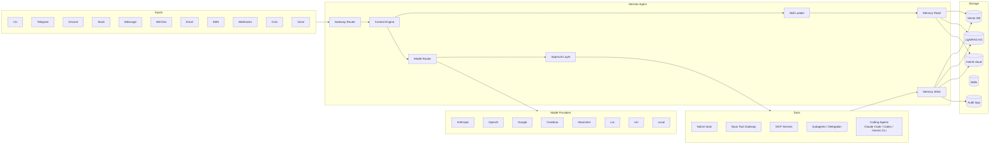
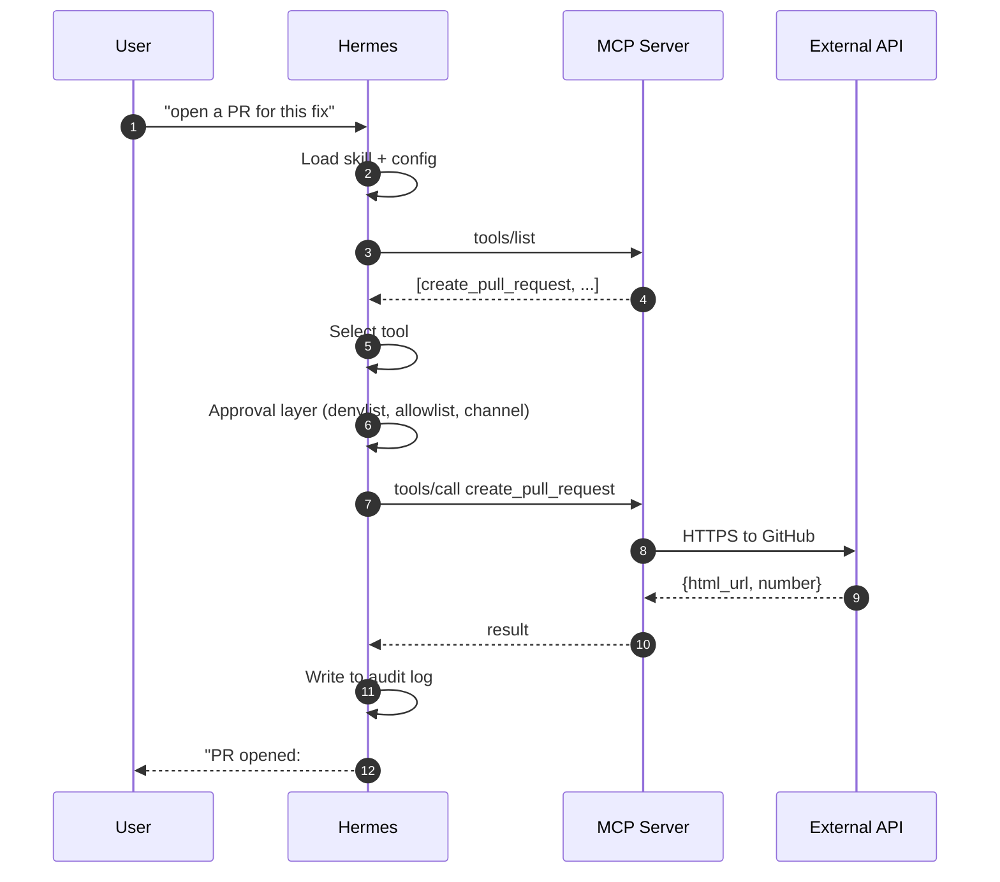
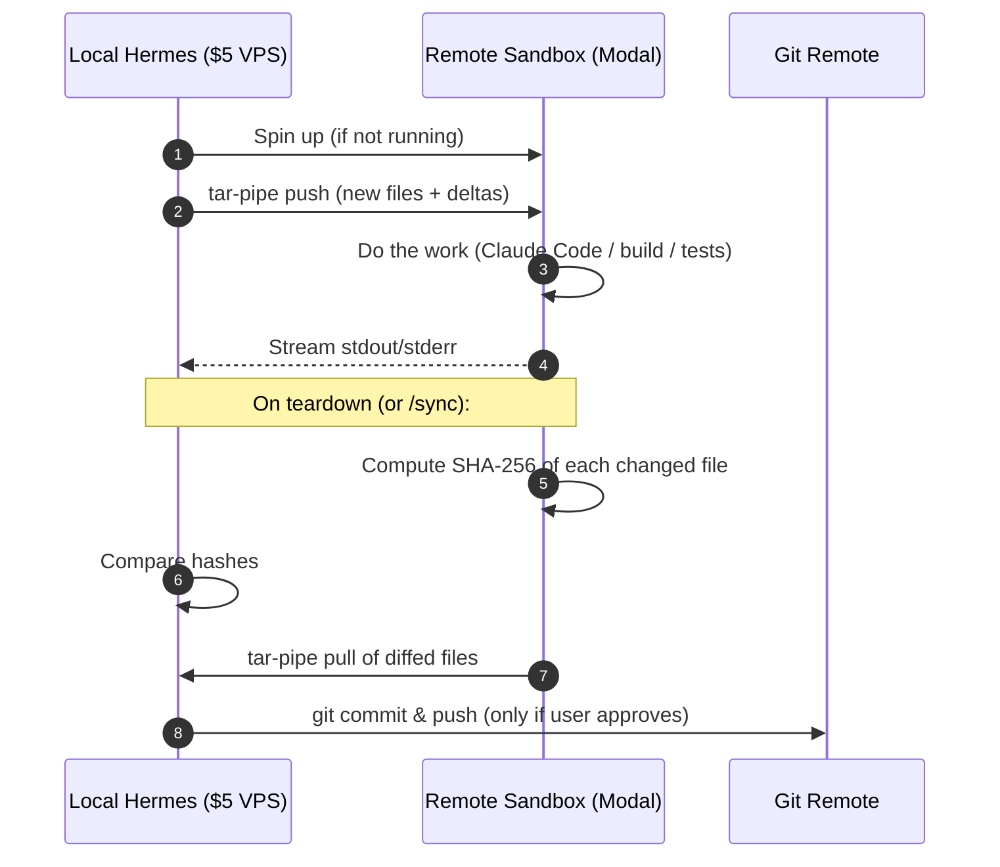
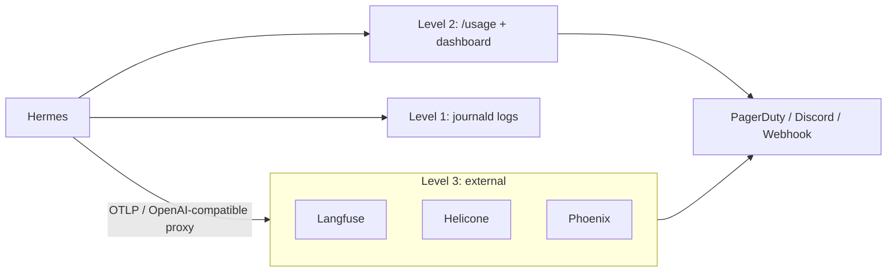

# Диаграммы архитектуры (architecture)

Все диаграммы выполнены в Mermaid — они рендерятся нативно на GitHub. Копируйте в свои документы по необходимости.

---

## Архитектура (architecture) Hermes верхнего уровня



---

## Поток интеграции MCP



---

## Делегирование кодинг-агенту (агент) (паттерн OpenClaw)

```mermaid
flowchart TB
  subgraph Telegram[Telegram Topic "feature-x"]
    Msg1[msg: implement foo]
    Msg2[msg: add tests]
    Msg3[msg: fix the null check]
  end

  subgraph Hermes[Hermes]
    Bind[bind-thread mapping]
  end

  subgraph Runtime[Persistent Claude Code]
    Sess[session state: cwd, branch, env]
  end

  Msg1 --> Bind
  Msg2 --> Bind
  Msg3 --> Bind
  Bind --> Sess

  Sess --> Git[(git repo)]
  Sess --> Bash[bash tool]
  Sess --> Read[Read tool]
  Sess --> Edit[Edit tool]
```

---

## Поток синхронизации удалённой песочницы (sandbox) (PR #8018)



---

## Стек observability



---

## Уровни безопасности (security) (Часть 19)

```mermaid
flowchart LR
  Input[Input<br/>Telegram/Discord/Email/Webhook] --> L1[Layer 1<br/>Origin labeling]
  L1 --> L2[Layer 2<br/>Approval + denylist]
  L2 --> L3[Layer 3<br/>Secrets redaction]
  L3 --> L4[Layer 4<br/>Webhook sig validation]
  L4 --> L5[Layer 5<br/>SSRF / redirect guard]
  L5 --> L6[Layer 6<br/>MCP trust levels]
  L6 --> L7[Layer 7<br/>Quarantine profile]
  L7 --> Exec[Tool execution]
  Exec --> Audit[(Audit log)]
```


